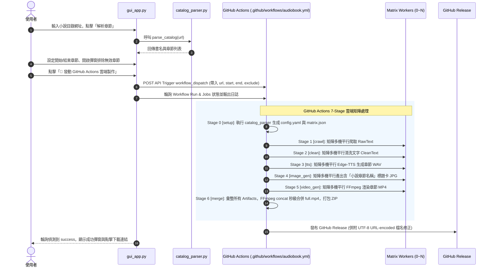
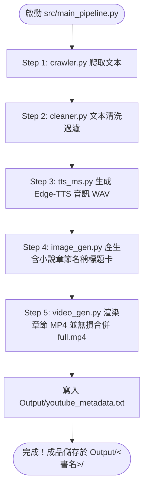

# 系統需求與架構規格書 (System Requirements & Architecture Specification)
## 全自動化有聲書量產系統 (Automated Audiobook Generation Pipeline)

基於「AI 沉浸式有聲圖書館」企劃，本文件定義了全自動化有聲書產出流水線的系統需求、程式碼架構、執行流程、視覺生成與檔案規範。

---

## 一、 系統總體目標與雙模式運作架構

本系統旨在建立一條高穩定、高擴展性的全自動流水線：從網路上抓取小說文本，經過自動清理與 AI 語音合成，最終與帶有「小說章節名稱」的高質感視覺素材結合，產出符合 YouTube 營利標準的長篇有聲書影片，全程無需人工介入。

系統支援 **雙執行模式**：
1. **雲端矩陣並行模式 (Cloud Matrix Parallel Mode)**：使用 `gui_app.py` 控制台發動，由 GitHub Actions 的 Matrix 策略進行 7-Stage 分散式並行運算（最多擴展至 250+ 台工作機平行發動），可在數分鐘內完成上百章小說之聲影合成，並發布 GitHub Release 供一鍵下載 ZIP 檔。
2. **本地單機極速模式 (Local Sequential Mode)**：使用 `src/main_pipeline.py` 按 Step 1~5 循序執行，適合單機調試或少量章節製作。

---

## 二、 現有 CODE 程式碼架構與模組劃分

### 1. 專案目錄與檔案結構樹

```text
.
├── .env                         # 本地環境變數（包含 GITHUB_REPO 與 GITHUB_TOKEN）
├── config.yaml                  # 當前小說任務之動態設定檔（由 catalog_parser 生成）
├── gui_app.py                   # Tkinter GUI 控制台（目錄解析、篩選章節、雲端觸發/取消/進度監控）
├── requirements.txt             # 依賴套件（requests, beautifulsoup4, pyyaml, edge-tts, pillow, python-dotenv）
├── .github/
│   └── workflows/
│       └── audiobook.yml        # GitHub Actions 7-Stage 矩陣平行工作流定義檔
└── src/
    ├── catalog_parser.py        # 小說目錄解析器、config.yaml 與 GHA Matrix JSON 自動生成器
    ├── crawler.py               # 網頁文本爬蟲（支援單機與 Matrix Worker 批次模式，含斷點續傳）
    ├── cleaner.py               # 文本清洗器（廣告過濾、智慧長句標點截斷、行數規範化）
    ├── tts_ms.py                # Edge-TTS 合成引擎（Microsoft Azure zh-CN-YunxiNeural，支援 nest_asyncio）
    ├── tts.py                   # GPT-SoVITS 本地 REST API 合成引擎（備用方案）
    ├── image_gen.py             # Pillow 章節標題卡生成器（讀取 RawText 第一行章節標題，繪製 1280x720 圖片）
    ├── video_gen.py             # FFmpeg 章節獨立影片極速渲染 + concat Copy 秒級合併 + metadata 時間戳生成
    ├── worker_pipeline.py       # GHA Worker 統一階段入口（--stage crawl/clean/tts/image_gen/video_gen）
    └── main_pipeline.py         # 本地單機主控程式（1~5 階段循序執行）
```

### 2. 核心組件職責說明

* **`gui_app.py` (GUI 控制台)**：
  - 基於 Tkinter / ttk (clam 主題)，提供視覺化操作介面。
  - **目錄解析與範圍選取**：輸入小說目錄網址，單擊「解析章節」呼叫 `catalog_parser.py` 解析書名與章節數，並提供彈窗核選框讓使用者排除「請假單」等非小說章節。
  - **雲端發動與控制**：單擊「發動 GitHub Actions 雲端製作」，自動讀取 `.env` 透過 REST API 呼叫 GitHub Workflow Dispatch，實時輪詢 workflow run 與多分頁 jobs 狀態，並提供一鍵下載 GitHub Release 的彈窗與 Log 區超連結。支援「強制取消」雲端任務。
* **`src/catalog_parser.py` (目錄與矩陣解析器)**：
  - 抓取小說目錄頁，解析書名（自動剔除檔名不合法字元）與章節 URL 列表。
  - `generate_config_yaml()`：生成 `config.yaml`。
  - `generate_matrix()`：依據 `chapters_per_worker` 計算 Matrix 切分，自動處理 GitHub Actions 上限 256 matrix 的動態調配，產生符合 GHA inputs 規範的 JSON。
* **`src/crawler.py` (文本爬蟲)**：
  - 支援單機全抓與 Worker 批次抓取模式。
  - 將網頁內文存為 `Workspace/<書名>/RawText/<書名>_chapter_<N>_raw.txt`。
  - **關鍵約定**：檔案**第一行**必為小說章節名稱（如 `第一章 山邊小村`），供後續 `image_gen.py` 與 `video_gen.py` 讀取。
  - 具備 `progress.json` 斷點續傳機制與隨機延遲 (2~5 秒) 防封鎖。
* **`src/cleaner.py` (文本清洗與智慧截斷)**：
  - 讀取 RawText，利用正則表達式剔除導覽列、廣告詞、請記住本站域名等雜訊。
  - 以全形標點 (。！？) 及句號/逗點智慧過濾截斷過長段落，嚴格控制每句不超過 100 字，按「每行一句」儲存至 `CleanText/<書名>_chapter_<N>_clean.txt`。
* **`src/tts_ms.py` (Edge-TTS 神經語音引擎)**：
  - 讀取 CleanText 進行 Edge-TTS 語音合成（預設聲線: `zh-CN-YunxiNeural`）。
  - 套用 `nest_asyncio.apply()` 以相容 Spyder/IPython asyncio 環境。
  - 先產出暫存 `.mp3` 後用 FFmpeg 轉成高相容 `.wav`（`Workspace/<書名>/Audio/<書名>_chapter_<N>.wav`）。
* **`src/tts.py` (GPT-SoVITS 備用引擎)**：
  - 本地 API 模式（HTTP REST `http://127.0.0.1:9880`），逐行朗讀並產出暫存 part 檔後經 FFmpeg 無損 concat。
* **`src/image_gen.py` (章節標題卡視覺生成器)**：
  - 掃描 `Audio/` 目錄章節 WAV，呼叫 Pillow 生成 1280×720 HD 標題卡圖片 `Workspace/<書名>/Images/<書名>_chapter_<N>.jpg`。
  - **標題讀取**：呼叫 `get_chapter_title()` 優先開啟 RawText **第一行**提取完整的**「小說章節標題名稱」**（例如：`第一章 山邊小村`），找不到時備用 `第N章`。
  - **視覺風格**：繪製深靛藍至近黑質感漸層背景、金色裝飾橫線、頂部金色《書名》、中央大字白色**「小說章節標題名稱」**帶黑色陰影（過長自動調整字號），具備 CJK 中文字型自動相容載入機制。
* **`src/video_gen.py` (影片極速渲染與合併器)**：
  - 第一階段：將章節標題卡圖片與章節 WAV 音訊搭配，以靜態圖片無 zoompan 模式（`-preset ultrafast -crf 28`）極速渲染成 `Workspace/<書名>/Video/<書名>_chapter_<N>.mp4`。
  - 第二階段：透過 FFmpeg `concat demuxer` (`-c copy`) 無損秒級合併所有章節 MP4 成 `Output/<書名>/<書名>_full.mp4`。
  - 附屬產出：自動寫入 `Output/<書名>/youtube_metadata.txt`（精準章節時間戳與 AI 聲明）。
* **`src/worker_pipeline.py` (GitHub Actions Worker 入口)**：
  - 提供 CLI 入口，供 GHA Workflow 各矩陣 Stage 呼叫 `--stage crawl/clean/tts/image_gen/video_gen`。
* **`src/main_pipeline.py` (本地單機主控)**：
  - 獨立 `try...except` 按順序 1~5 Step 執行本地流水線。
* **`.github/workflows/audiobook.yml` (雲端平行自動化 Workflow)**：
  - 7 階段 Workflow：Setup -> Crawl -> Clean -> TTS -> Image -> Video -> Merge/Release。
  - 特殊處理：網址編碼處理（解決 GitHub Release 中文檔名被下載為 `default.zip` 的瀏覽器相容問題）。

---

## 三、 現有執行流程 (Execution Workflows)

### 1. 雲端矩陣平行流程 (Cloud Matrix Workflow via GUI & GitHub Actions)



---

### 2. 本地單機極速流程 (Local Sequential Pipeline)



---

## 四、 視覺標題卡圖片生成規約 (Image Generation Specs)

為符合 YouTube 原創內容規範並提升觀眾沉浸體驗，系統產出的圖片**絕非固定背景**，而是**精準包含「小說章節標題名稱」**的動態標題卡。

### 1. 章節標題名稱提取機制 (`get_chapter_title`)
1. 當 `image_gen.py` 或 `video_gen.py` 為第 `N` 章生成標題卡時，會讀取 `Workspace/<書名>/RawText/<書名>_chapter_<N>_raw.txt`。
2. 提取該檔案的**第一行文字**作為 `chapter_title`（例如：`第一章 山邊小村`、`第102章 強敵壓境`）。
3. 若檔案不存在或第一行為空，則 fallback 顯示 `第N章`。

### 2. 標題卡視覺美學與排版規格 (1280 × 720 HD)
* **背景 (Background)**：Pillow 逐行繪製極致深沉的漸層色彩，由上方的深靛藍 (5, 8, 30) 漸變至下方的近黑色 (15, 20, 50)，營造質感與神秘感。
* **裝飾橫線 (Decorative Lines)**：位於 `H/4` 與 `H*3/4` 處繪製 1px 金色分割橫線 (RGB: 212, 175, 55)。
* **小說書名 (Book Title)**：位於上方 1/3 處，採用金色字體 (Size 52) 置中繪製《小說書名》。
* **小說章節標題名稱 (Chapter Title Name)**：
  - 位於中央視覺區域（Size 80），採用純白大字 (255, 255, 255) 並在右下方加設 3px 半透明黑色陰影 (0, 0, 0, 180) 確保閱讀清晰度。
  - 當章節標題過長（超過 1080px 寬度）時，字級自動降階為 Size 52 避免超出邊界。
* **字型相容性 (Font Fallback)**：
  - 依序自動搜尋系統字型：Linux (`NotoSansCJK-Regular.ttc`, `wqy-zenhei.ttc`) 與 Windows (`msyh.ttc` 微軟正黑/雅黑)。

---

## 五、 資料儲存結構與檔名規範 (Storage & Naming Conventions)

### 1. 專案工作區與成品目錄結構

```text
Workspace/<書名>/
  ├── system.log                   # 系統執行日誌
  ├── progress.json                # 爬蟲斷點續傳進度檔
  ├── RawText/                     # 原始抓取文本
  │   └── <書名>_chapter_<N>_raw.txt   (第1行為小說章節名稱)
  ├── CleanText/                   # TTS 專用過濾清洗文本
  │   └── <書名>_chapter_<N>_clean.txt (每行單句 <= 100字)
  ├── Audio/                       # 章節 WAV 音訊檔
  │   └── <書名>_chapter_<N>.wav
  ├── Images/                      # 章節標題卡圖片檔
  │   └── <書名>_chapter_<N>.jpg   (含小說章節標題名稱)
  └── Video/                       # 章節獨立 MP4 暫存
      └── <書名>_chapter_<N>.mp4

Output/<書名>/                       # 最終出版成品
  ├── <書名>_full.mp4              # 全書無損合併單一 MP4
  └── youtube_metadata.txt         # 精準章節時間戳與 AI 宣告
```

### 2. 檔名格式對照表

| 產物類型 | 檔名格式範例 | 說明 |
| :--- | :--- | :--- |
| **原始文本** | `凡人修仙傳_chapter_1_raw.txt` | 包含標題與內文之生肉文本 |
| **清洗文本** | `凡人修仙傳_chapter_1_clean.txt` | 無廣告、已截斷之 TTS 專用文本 |
| **章節音訊** | `凡人修仙傳_chapter_1.wav` | 24kHz / 16bit 單路章節語音 |
| **章節標題卡** | `凡人修仙傳_chapter_1.jpg` | 1280x720 帶有「第一章 山邊小村」大字之圖片 |
| **章節影片** | `凡人修仙傳_chapter_1.mp4` | 靜態圖 + 音訊 ultrafast 渲染中間影片 |
| **全書影片** | `凡人修仙傳_full.mp4` | concat Copy 秒級合併之最終上傳檔 |
| **時間戳檔** | `youtube_metadata.txt` | YouTube 描述欄專用時間戳檔 |
| **雲端 Release 檔** | `凡人修仙傳.zip` / `%E5...zip` | 含全部結構之壓縮打包檔（含 UTF-8 編碼修正） |

---

## 六、 YouTube 營利防禦與營運指南

為維護頻道品質並通過 YouTube 二次創作與營利審查：
1. **章節標題卡差異化**：透過 `image_gen.py` 為每一章繪製包含「該章小說章節名稱」的獨特封面，解決「重複內容 (Reused Content)」降權問題。
2. **SEO 時間戳導引**：自動生成 `youtube_metadata.txt` 中的時間戳格式（如 `00:00:00 第一章 山邊小村`），可直接複製至頻道描述欄。
3. **聲明與標記**：上傳時勾選「AI 生成內容」，並在描述欄下方保留系統自動附帶的 AI 語音與圖像輔助創作聲明。
