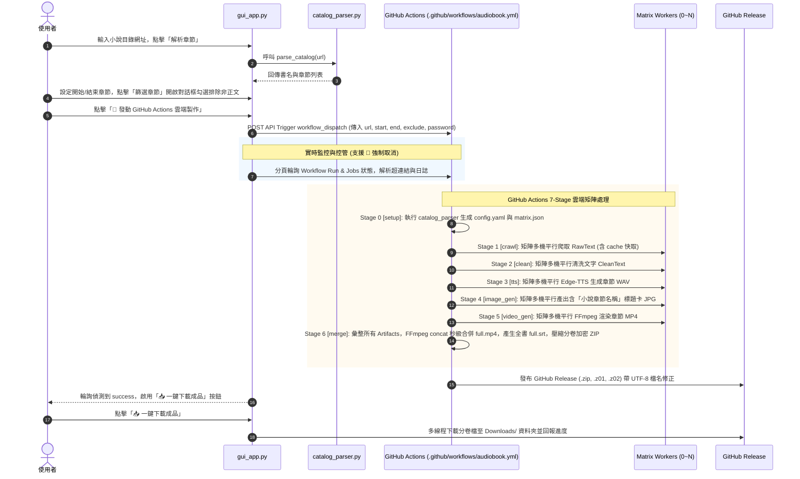

# 系統需求與架構規格書 (System Requirements & Architecture Specification)
## 全自動化有聲書量產系統 (Automated Audiobook Generation Pipeline)

本文件定義了全自動化有聲書產出流水線的系統需求、程式碼架構、執行流程、視覺/字幕生成與檔案規範。

---

## 一、 系統總體目標與雙模式運作架構

本系統旨在建立一條高穩定、高擴展性的全自動流水線：從網路上抓取小說文本，經過自動清理與 AI 語音合成，最終與帶有「小說章節名稱」的高質感視覺標題卡及自動對齊字幕結合，產出符合 YouTube 營利標準的長篇有聲書影片，全程無需人工介入。

系統支援 **雙執行模式**：
1. **雲端矩陣並行模式 (Cloud Matrix Parallel Mode)**：使用 `gui_app.py` 控制台發動，由 GitHub Actions 的 Matrix 策略進行 7-Stage 分散式並行運算，可在數分鐘內完成上百章小說之聲影與字幕合成，並發布加密切割 GitHub Release，支援 GUI 一鍵多線程下載 ZIP 檔與 Google Drive 斷點續傳。
2. **本地單機極速模式 (Local Sequential Mode)**：使用 `src/main_pipeline.py` 按 Step 1~5 循序執行，適合單機調試或少量章節製作。

---

## 二、 現有 CODE 程式碼架構與模組劃分

### 1. 專案目錄與檔案結構樹

```text
.
├── .env                         # 本地環境變數（包含 GITHUB_REPO, GITHUB_TOKEN, ZIP_PASSWORD, GCP_CREDENTIALS）
├── config.yaml                  # 當前小說任務之動態設定檔（由 catalog_parser 生成）
├── 系統需求書.md                 # 系統需求與架構規格書
├── gui_app.py                   # Tkinter GUI 控制台（目錄解析、章節彈窗篩選、雲端發動/強行取消/分頁 Job 進度輪詢/超連結/批量下載器）
├── requirements.txt             # 依賴套件（requests, beautifulsoup4, pyyaml, edge-tts, pillow, python-dotenv, google-api-python-client）
├── fonts/                       # 國風毛筆狂草字型庫 (含 YujiBoku, MaShanZheng, ZhiMangXing)
├── Upload_Subtitles/            # 完整 Part 合併字幕庫 (自動上傳至 YouTube CC Caption Track)
├── .github/
│   └── workflows/
│       ├── audiobook.yml        # GitHub Actions 7-Stage 矩陣平行工作流定義檔（含快取備份與分卷加密 Release）
│       └── youtube_stream.yml   # YouTube Live RTMP 直播推流工作流 (僅供手動發動)
└── src/
    ├── catalog_parser.py        # 小說目錄解析器、config.yaml 與 GHA Matrix JSON 自動生成器
    ├── crawler.py               # 網頁文本爬蟲（支援單機與 Worker 批次模式，含 progress.json 斷點續傳）
    ├── cleaner.py               # 文本清洗器（廣告過濾、18字單行智慧文句截斷、行數規範化）
    ├── tts_ms.py                # Edge-TTS 合成引擎（Microsoft Azure zh-CN-YunxiNeural，標點保留自然停頓）
    ├── tts.py                   # GPT-SoVITS 本地 REST API 合成引擎（備用方案）
    ├── image_gen.py             # Pillow 章節標題卡生成器（讀取 RawText 第一行章節標題，繪製深藍金邊標題卡）
    ├── metadata_gen.py          # 2K 商業級毛筆狂草封面與 YouTube 元數據生成器（右對齊自適應排版、完結徽章、無AI雜訊）
    ├── video_gen.py             # FFmpeg 章節獨立影片極速渲染 + 映院級單行字幕 (BorderStyle=1, MarginV=45) + 無損合併
    ├── subtitle_gen.py          # SRT 字幕生成與對齊器（標點剝離 strip_subtitle_punctuation、Part 合併 SRT 生成）
    ├── part_builder.py          # 10~11 小時無縫 Part 切分與自動打包工具
    ├── youtube_api_uploader.py  # YouTube API 自動上傳器 (影片上傳、CC 字幕檔自動對齊上傳與舊軌清理)
    ├── stream_to_youtube.py     # YouTube Live RTMP 推流工具 (手動備用按鈕)
    ├── gdrive_sync.py           # Google Drive 狀態同步模組
    ├── worker_pipeline.py       # GHA Worker 統一階段入口
    └── main_pipeline.py         # 本地單機主控程式
```

### 2. 核心組件職責說明

* **`src/cleaner.py` (文本清洗與 18 字智慧單行截斷)**：
  - 讀取 RawText，剔除導覽列、廣告詞等雜訊。
  - 導入 `split_overlong_clause(text, hard_max=18)`，將長句嚴格截斷為 8~18 字單行結構，保證字幕在播放時 100% 呈單行顯示，絕不出現三行混亂文字塊。
* **`src/subtitle_gen.py` (電影級字幕生成與標點剝離)**：
  - 實作 `strip_subtitle_punctuation()`：在產出 SRT 時自動剝離句尾標點符號（`，`、`。`、`；`），符合專業影視字幕規範；TTS 合成時保留標點以維護自然停頓與語調。
  - 實作 `generate_part_srt()`：將各章 `.srt` 自動合併為全 Part 完整字幕檔，並自動儲存至 `Upload_Subtitles/<filename>.srt`。
* **`src/video_gen.py` (電影級字幕樣式渲染與 AI 雜訊清除)**：
  - 套用 FFmpeg `force_style`: `FontSize=18, PrimaryColour=&H00FFFFFF, OutlineColour=&H00000000, BorderStyle=1, Outline=2, Shadow=1, MarginV=45, MarginL=80, MarginR=80, WrapStyle=0`。
  - 採用無黑框獨立文字描邊，字幕抬高 45px 避開 YouTube/Windows 播放器進度條。
  - 全面清理所有 `⚠️ 本內容採用 AI 輔助製作...` 等提示文字。
* **`src/metadata_gen.py` (2K 商業級毛筆狂草封面與自適應排版引擎)**：
  - **飛白勁道狂草字體**：優先載入 Google Fonts `YujiBoku-Regular.ttf` (飛白毛筆狂草) 與 `FZSTK.TTF` (方正舒體)，展現勁道張力與墨跡視覺。
  - **100% 繁體字庫無缺字**：支援 `傳` 字等繁體字元全覆蓋，絕不出 `□` 豆腐塊。
  - **自適應右對齊智慧排版引擎**：支援 3~20 字任意長度小說書名，自動依字數與標點符號進行分級縮放（210pt -> 155pt -> 115pt）與右對齊（120px 右邊距）排版。
  - **右下角醒目【已完結】徽章**：於右下角 `y = H - 140px` 繪製高對比翡翠綠 `【 已完結 】` 圓角徽章（避開進度條），大幅提升吸引力與點擊率。
  - **純淨無廢話**：刪除假聲明與無用膠囊。
* **`src/part_builder.py` (10~11 小時無縫 Part 切分)**：
  - 自動將長篇小說按 10~11 小時目標時長無縫分部（Part_01, Part_02），章節號連續無縫隙。
* **`src/youtube_api_uploader.py` (YouTube 上傳與 CC 字幕軌整合規約)**：
  - 影片上傳成功後，自動將 `Upload_Subtitles/<filename>.srt` 上傳至 YouTube 視為 CC 字幕軌。
  - 上傳前自動清理舊有測試字幕軌，防止軌道衝突。

---

## 三、 視覺封面與字幕生成規約

### 1. YouTube 2K 全書 AI 書法封面規約 (`metadata_gen.py`)

系統統一固定採用 **「標準三元素固定版型 (Standard 3-Element Fixed Layout)」**：
1. **左上角 (Top-Left)**：集數與部數琉璃徽章（例如：`【第 1 部】 第 001 - 002 集`，紅底金邊，加大垂直 Margins 與上下 Padding，防止文字貼邊）。
2. **右邊中間 (Middle-Right)**：小說書名（`《書名》`，自適應動態縮放與 120px 右對齊排版，100% 繁體中文字庫覆蓋無缺字）。
3. **右下角 (Bottom-Right)**：完結狀態徽章（`【 已完結 】` 翡翠綠 / `【 連載中 】` 琥珀金，抬高 `y = H - 140px` 避開 YouTube 播放時長標記）。

### 2. 電影級單行字幕與 CC 軌規約 (`cleaner.py` & `subtitle_gen.py`)

1. **單行字數**：嚴格限制每行 8~18 個中文字，禁止多行字幕疊加。
2. **標點剝離**：SRT 檔自動移除句尾標點（`，`、`。`、`；`）。
3. **無黑框描邊**：`BorderStyle=1, Outline=2, Shadow=1`，抬高 `MarginV=45` 避開進度條。
4. **CC 軌自動同步**：Part 檔合成完畢後自動匯出 `Upload_Subtitles/<Part名>.srt` 並經由 OAuth 上傳至 YouTube。

---

## 四、 嚴格禁令與運作準則 (Strict Prohibitions)

1. **無 AI 免責聲明（Strict Prohibition）**：
   - 嚴禁在影片、字幕、描述欄或封面出現 `⚠️ 本內容採用 AI 輔助製作...`、`AI語音` 或 `全自動 AI 有聲書...` 等字眼。
2. **無自動 RTMP 直播（No Automatic RTMP Streaming）**：
   - `stream_to_youtube.py` 嚴禁插入常規生產流程（`audiobook.yml`），僅作為 GUI 之手動備用功能。
3. **YouTube 配額保護與備份**：
   - 若遇到 `403 quotaExceeded`，系統自動保留本地 `Upload_Subtitles/` 字幕檔並紀錄 Log，供後續重試。

---

## 五、 資料儲存結構與檔名規範

```text
Workspace/<書名>/Part_01/
  ├── youtube_title.txt            # YouTube 純淨標題
  ├── youtube_description.txt      # 帶章節時間戳之簡介 (無 AI 宣告)
  ├── youtube_cover.jpg            # 2K 大氣書法封面 (含右下角【已完結】徽章)
  └── <書名>_process_log.txt        # 處理日誌

Upload_Subtitles/                  # 上傳至 YouTube CC 之完整 Part SRT 庫
  └── <書名>_Part_01.srt
```

### 3. 現有執行流程 (Execution Workflows)



---

## 四、 視覺標題卡與字幕生成規約

### 1. 章節標題卡與全書 AI 封面生成規約 (`image_gen.py` & `metadata_gen.py`)

為符合 YouTube 原創內容規範並提升觀眾沉浸體驗，系統支援兩種等級視覺產物：

1. **章節標題卡 (`image_gen.py`)**：
   - **標題提取**：讀取 `RawText` 第一行文字（如 `第一章 山邊小村`）。
   - **視覺規格 (1280 × 720 HD)**：深靛藍至近黑漸層背景、金色分割線、頂部金色《書名》、中央大字純白章節名稱（帶 3px 黑色陰影）。

2. **YouTube 2K 全書 AI 藝術封面 (`metadata_gen.py`)**：
   - **網路劇情自動搜尋**：自動透過維基百科 REST API 與 DuckDuckGo 擷取小說真實劇情簡介。
   - **純劇情雜訊過濾**：自動剔除作者、出版年份、連載平台等元數據雜訊，保留純故事主線。
   - **Prompt 翻譯與組裝**：免費呼叫 MyMemory API 將純劇情翻譯為英文，組裝精美的動漫風 Flux 模型 Prompt。
   - **2K AI 生圖與 Pillow 高級合成 (2560 × 1440 QHD)**：連線 Pollinations AI (Flux 大模型) 下載超高畫質底圖，自動疊加頂/底部漸變黑階遮罩、左上角紅色【章節範圍徽章】、右上角綠色【已完結徽章】與左下角燙金立體粗描邊《小說名稱》。
   - **自動寫入元數據與 Log**：輸出 `youtube_title.txt`、`youtube_description.txt`、`youtube_cover.jpg` 與全過程 `process_log.txt` 至 `Workspace/<書名>/` 目錄。

### 2. 字幕生成與對齊規約 (`subtitle_gen.py`)

1. **時間軸精準對齊**：Edge-TTS 逐句生成音訊時，記錄各句 WAV 檔實際時間長度，換算為 SRT 標準格式 `HH:MM:SS,mmm`。
2. **單章與全書字幕彙整**：
   - 單章階段產出 `Workspace/<書名>/SRT/<書名>_chapter_<N>.srt`。
   - 全書合併階段（Stage 6）計算各章節累計秒數位移，平移時間戳後組裝成 `Output/<書名>/<書名>_full.srt`。

---

## 五、 資料儲存結構與檔名規範 (Storage & Naming Conventions)

### 1. 專案工作區與成品目錄結構

```text
Workspace/<書名>/
  ├── system.log                   # 系統執行日誌
  ├── progress.json                # 爬蟲斷點續傳進度檔
  ├── RawText/                     # 原始抓取文本 (第1行為小說章節名稱)
  │   └── <書名>_chapter_<N>_raw.txt
  ├── CleanText/                   # TTS 專用過濾清洗文本 (每行單句 <= 100字)
  │   └── <書名>_chapter_<N>_clean.txt
  ├── Audio/                       # 章節 WAV 音訊檔
  │   └── <書名>_chapter_<N>.wav
  ├── Images/                      # 章節標題卡圖片檔 (含小說章節標題名稱)
  │   └── <書名>_chapter_<N>.jpg
  ├── Video/                       # 章節獨立 MP4 暫存
  │   └── <書名>_chapter_<N>.mp4
  └── SRT/                         # 章節字幕檔
      └── <書名>_chapter_<N>.srt

Output/<書名>/                       # 最終出版成品
  ├── <書名>_full.mp4              # 全書無損合併單一 MP4
  ├── <書名>_full.srt              # 全書時間軸對齊 SRT 字幕檔
  └── youtube_metadata.txt         # 精準章節時間戳與 AI 宣告

Downloads/                         # GUI 下載器本機儲存區
  ├── <書名>.zip                   # 主壓縮檔 (解壓此檔即可)
  ├── <書名>.z01                   # 1.9GB 分卷檔 1
  └── <書名>.z02                   # 1.9GB 分卷檔 2
```

### 2. 檔名格式對照表

| 產物類型 | 檔名格式範例 | 說明 |
| :--- | :--- | :--- |
| **原始文本** | `凡人修仙傳_chapter_1_raw.txt` | 包含標題與內文之生肉文本 |
| **清洗文本** | `凡人修仙傳_chapter_1_clean.txt` | 無廣告、已截斷之 TTS 專用文本 |
| **章節音訊** | `凡人修仙傳_chapter_1.wav` | 24kHz / 16bit 單路章節語音 |
| **章節標題卡** | `凡人修仙傳_chapter_1.jpg` | 1280x720 帶有「第一章 山邊小村」大字之圖片 |
| **章節影片** | `凡人修仙傳_chapter_1.mp4` | 靜態圖 + 音訊 ultrafast 渲染中間影片 |
| **章節字幕** | `凡人修仙傳_chapter_1.srt` | 時間軸對齊單章 SRT 字幕 |
| **全書影片** | `凡人修仙傳_full.mp4` | concat Copy 秒級合併之最終上傳檔 |
| **全書字幕** | `凡人修仙傳_full.srt` | 完整時間軸外掛 SRT 字幕檔 |
| **時間戳檔** | `youtube_metadata.txt` | YouTube 描述欄專用時間戳檔 |
| **雲端 Release 檔** | `凡人修仙傳.zip` / `.z01` | 分卷加密打包檔（含 UTF-8 解碼修正） |

---

## 六、 YouTube 營利防禦與安全運作指南

為維護頻道品質並順利通過 YouTube 二次創作與營利審查：
1. **動態封面避開重複內容**：透過 `image_gen.py` 為每一章繪製包含「該章小說章節名稱」的獨特封面，解決 YouTube「重複內容 (Reused Content)」降權機制。
2. **外掛 SRT 字幕防護**：產出 `full.srt` 提供完整中文字幕，大幅提高影片在 YouTube 演算法中的品質權重與觀眾停留率。
3. **SEO 時間戳導引**：自動生成 `youtube_metadata.txt` 中的時間戳格式（如 `00:00:00 第一章 山邊小村`），可直接複製至頻道描述欄。
4. **雲端與檔名安全**：
   - 壓縮檔預設啟用 `ZIP_PASSWORD` 加密保護，避免開放資產洩漏。
   - GitHub Release 自動對檔名進行 `unquote` UTF-8 解碼，解決瀏覽器與 GUI 下載時檔名被縮寫或變更為 `default.zip` 之問題。
