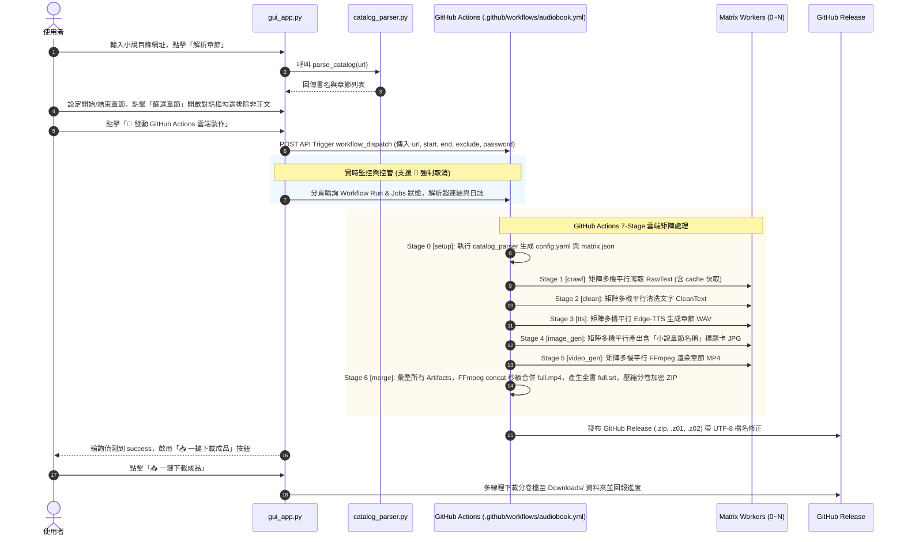
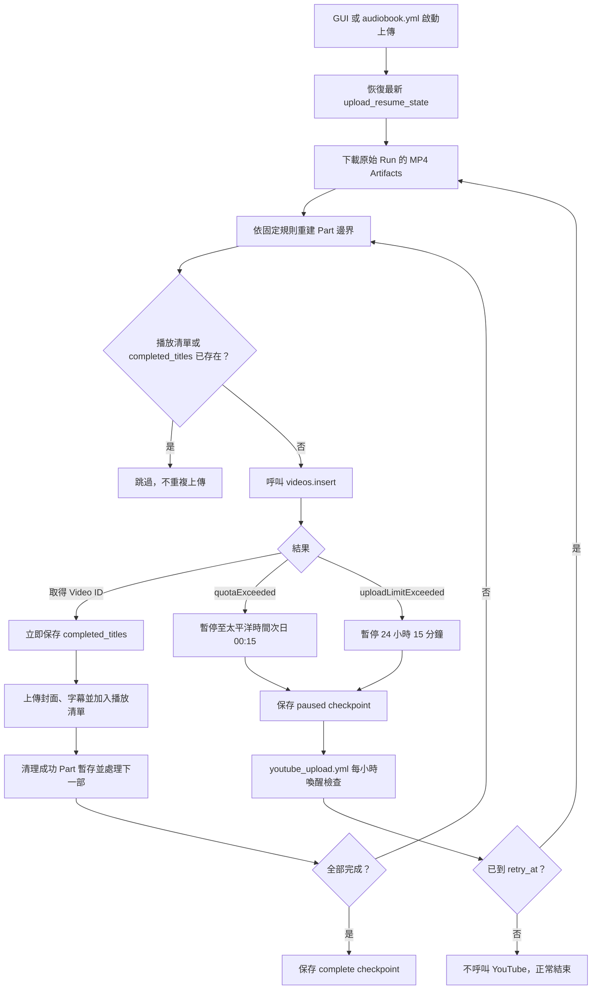

# 系統需求與架構規格書 (System Requirements & Architecture Specification)
## 全自動化有聲書量產系統 (Automated Audiobook Generation Pipeline)

本文件定義了全自動化有聲書產出流水線的系統需求、程式碼架構、執行流程、視覺/字幕生成與檔案規範。

> **規格更新（2026-08-06）**：正式製作流程停止每章摘要與 Qwen／Transformers 摘要模型；章節圖恢復舊版深靛藍視覺並以無摘要版型重新排版；封面恢復原有書法排版，同一本小說的所有 Part 固定重用單一無文字 `master_cover.jpg`。主視覺升級為 **Google AI Studio (Gemini LLM 藝術總監)** 讀取全本小說名稱與完整簡介進行 100% 動態全題材分析，不使用本地題材關鍵字分類，並強制執行大眾審美高顏值與華麗服飾規範（extremely handsome/stunningly gorgeous）。Gemini、手動 `cover_brief.json` 與中性提示詞三種來源在送往 Hugging Face 前，均由程式統一附加明確的 **Light Painting** 全域畫風及無文字／Logo／水印限制，再餵給 FLUX.1-schnell 進行 16:9 原生生圖與 LANCZOS 2K 縮放。取消 180 字與機翻限制，並嚴格實施零低品質圖片備援（若 GEMINI_API_KEY / HF_TOKEN 缺失或生圖失敗，立即中斷流程，不產出垃圾封面）。


---

## 一、 系統總體目標與雙模式運作架構

本系統旨在建立一條高穩定、高擴展性的全自動流水線：從網路上抓取小說文本，經過自動清理與 AI 語音合成，最終與帶有「小說章節名稱」的高質感視覺標題卡及自動對齊字幕結合，產出符合 YouTube 營利標準的長篇有聲書影片，全程無需人工介入。

系統支援 **雙執行模式**：
1. **雲端矩陣並行模式 (Cloud Matrix Parallel Mode)**：使用 `gui_app.py` 控制台發動，由 GitHub Actions 的 Matrix 策略進行 7-Stage 分散式並行運算，可在數分鐘內完成上百章小說之聲影與字幕合成，並發布加密切割 GitHub Release，支援 GUI 一鍵多線程下載 ZIP 檔與 Google Drive 斷點續傳。
2. **本地單機極速模式 (Local Sequential Mode)**：使用 `src/main_pipeline.py` 按 Step 1~5 循序執行，適合單機調試或少量章節製作。

---

## 二、 現有 CODE 程式碼架構與模組劃分

### 1. 專案目錄與檔案結構樹

```text
.
├── .env                         # 本地環境變數（包含 GITHUB_REPO, GITHUB_TOKEN, GEMINI_API_KEY, ZIP_PASSWORD, GDRIVE_FOLDER_ID）

├── config.yaml                  # 當前小說任務之動態設定檔（由 catalog_parser 生成）
├── 系統需求書.md                 # 系統需求與架構規格書
├── gui_app.py                   # Tkinter GUI 控制台（目錄解析、章節彈窗篩選、雲端發動/強行取消/分頁 Job 進度輪詢/超連結/批量下載器）
├── requirements.txt             # 依賴套件（requests, beautifulsoup4, pyyaml, edge-tts, pillow, python-dotenv, google-api-python-client）
├── fonts/                       # 國風毛筆狂草字型庫 (含 YujiBoku, MaShanZheng, ZhiMangXing)
├── Upload_Subtitles/            # 完整 Part 合併字幕庫 (自動上傳至 YouTube CC Caption Track)
├── .github/
│   └── workflows/
│       ├── audiobook.yml        # GitHub Actions 7-Stage 矩陣平行工作流定義檔（含快取備份與分卷加密 Release）
│       ├── youtube_upload.yml    # YouTube 手動上傳及每小時自動喚醒續傳工作流
│       └── youtube_stream.yml   # YouTube Live RTMP 直播推流工作流 (僅供手動發動)
└── src/
    ├── catalog_parser.py        # 小說目錄解析器、config.yaml 與 GHA Matrix JSON 自動生成器
    ├── crawler.py               # 網頁文本爬蟲（支援單機與 Worker 批次模式，含 progress.json 斷點續傳）
    ├── cleaner.py               # 文本清洗器（廣告過濾、18字單行智慧文句截斷、行數規範化）
    ├── tts_ms.py                # Edge-TTS 合成引擎（Microsoft Azure zh-CN-YunxiNeural，標點保留自然停頓）
    ├── tts.py                   # GPT-SoVITS 本地 REST API 合成引擎（備用方案）
    ├── image_gen.py             # Pillow 無摘要章節標題卡生成器（舊版深靛藍底、金線、白色章名、字幕安全區）
    ├── metadata_gen.py          # 整合 Gemini LLM 藝術總監 Prompt 引擎、FLUX 2K 主視覺下載與原有書法封面排版

    ├── summary_gen.py           # 歷史摘要工具（保留但不得由正式製作流程匯入或呼叫）
    ├── video_gen.py             # FFmpeg 章節獨立影片極速渲染 + 映院級單行字幕 (BorderStyle=1, MarginV=45) + 無損合併
    ├── subtitle_gen.py          # SRT 字幕生成與對齊器（標點剝離 strip_subtitle_punctuation、Part 合併 SRT 生成）
    ├── part_builder.py          # 10~11 小時無縫 Part 切分與自動打包工具
    ├── youtube_api_uploader.py  # YouTube API 自動上傳器 (影片上傳、CC 字幕檔自動對齊上傳與舊軌清理)
    ├── stream_to_youtube.py     # YouTube Live RTMP 推流工具 (手動備用按鈕)
    ├── gdrive_sync.py           # Google Drive 狀態同步模組
    ├── worker_pipeline.py       # GHA Worker 統一階段入口
    └── main_pipeline.py         # 本地單機主控程式
```

### 2. 核心組件職責說明

* **`src/cleaner.py` (文本清洗與 18 字智慧單行截斷)**：
  - 讀取 RawText，剔除導覽列、廣告詞等雜訊。
  - 導入 `split_overlong_clause(text, hard_max=18)`，將長句嚴格截斷為 8~18 字單行結構，保證字幕在播放時 100% 呈單行顯示，絕不出現三行混亂文字塊。
* **`src/subtitle_gen.py` (電影級字幕生成與標點剝離)**：
  - 實作 `strip_subtitle_punctuation()`：在產出 SRT 時自動剝離句尾標點符號（`，`、`。`、`；`），符合專業影視字幕規範；TTS 合成時保留標點以維護自然停頓與語調。
  - 實作 `generate_part_srt()`：將各章 `.srt` 自動合併為全 Part 完整字幕檔，並自動儲存至 `Upload_Subtitles/<filename>.srt`。
* **`src/video_gen.py` (電影級字幕樣式渲染與 AI 雜訊清除)**：
  - 套用 FFmpeg `force_style`: `FontSize=18, PrimaryColour=&H00FFFFFF, OutlineColour=&H00000000, BorderStyle=1, Outline=2, Shadow=1, MarginV=45, MarginL=80, MarginR=80, WrapStyle=0`。
  - 採用無黑框獨立文字描邊，字幕抬高 45px 避開 YouTube/Windows 播放器進度條。
  - 全面清理所有 `⚠️ 本內容採用 AI 輔助製作...` 等提示文字。
  - 章節圖片缺失時僅呼叫 `image_gen.generate_title_card()` 補圖，不得讀取 `Summaries/`、匯入 `summary_gen.py` 或載入任何摘要模型。
* **`src/metadata_gen.py` (2K 商業級毛筆狂草封面與自適應排版引擎)**：
  - **飛白勁道狂草字體**：優先載入 Google Fonts `YujiBoku-Regular.ttf` (飛白毛筆狂草) 與 `FZSTK.TTF` (方正舒體)，展現勁道張力與墨跡視覺。
  - **100% 繁體字庫無缺字**：支援 `傳` 字等繁體字元全覆蓋，絕不出 `□` 豆腐塊。
  - **自適應右對齊智慧排版引擎**：支援 3~20 字任意長度小說書名，自動依字數與標點符號進行分級縮放（210pt -> 155pt -> 115pt）與右對齊（120px 右邊距）排版。
  - **右下角醒目【已完結】徽章**：於右下角 `y = H - 140px` 繪製高對比翡翠綠 `【 已完結 】` 圓角徽章（避開進度條），大幅提升吸引力與點擊率。
  - **純淨無廢話**：刪除假聲明與無用膠囊。
  - **每書單一無文字主視覺**：固定使用 `Workspace/<書名>/Cover/master_cover.jpg`。檔案存在、可解碼且解析度達最低門檻時，所有 Part 與 YouTube 上傳流程必須直接重用，不得再次呼叫生圖服務。
  - **主視覺與 Part 封面分離**：`master_cover.jpg` 永遠不得含書名、部數、章節範圍或完結狀態；各 `Part_XX/youtube_cover.jpg` 只能由 master 複本疊字產生，不得把任何 Part 成品反過來當底圖。
  - **強制重生入口**：僅在 `force_regenerate_master=True` 或環境變數 `FORCE_REGENERATE_MASTER_COVER=1` 時允許重生；正常執行預設使用快取。
  - **實際解析度揭露**：生圖服務回傳尺寸低於要求時必須記錄「要求尺寸」與「實際尺寸」警告。禁止把插值放大後的檔案宣稱為原生 2K 細節。
* **`src/part_builder.py` (10~11 小時無縫 Part 切分)**：
  - 自動將長篇小說按 10~11 小時目標時長無縫分部（Part_01, Part_02），章節號連續無縫隙。
  - 合併前檢查既有 Part MP4；有效檔案直接沿用，不重複執行 FFmpeg。
  - 合併期間輸出至 `.partial.mp4`，確認檔案有效後才原子替換正式 MP4，避免中斷留下半成品。
* **`src/youtube_api_uploader.py` (YouTube 上傳與 CC 字幕軌整合規約)**：
  - 影片上傳成功後，自動將 `Upload_Subtitles/<filename>.srt` 上傳至 YouTube 視為 CC 字幕軌。
  - 上傳前自動清理舊有測試字幕軌，防止軌道衝突。
  - 維護 `upload_resume_state/state.json`，保存來源 GitHub Run ID、隱私設定、工作狀態、限制原因、安全重試時間及已上傳影片標題。
  - 僅在取得 YouTube Video ID 後才允許清理來源影片及推進 Part；上傳失敗不得刪檔或將該 Part 標記完成。
  - Video ID 取得後必須立即寫入 checkpoint，再處理字幕及播放清單，防止字幕或播放清單 API 中斷造成影片重複上傳。
  - 每次重跑同時比對播放清單既有標題與 checkpoint 已完成標題，兩者任一命中即跳過上傳。

---

## 三、 視覺封面與字幕生成規約

### 1. YouTube 2K 全書 AI 書法封面規約 (`metadata_gen.py`)

系統統一固定採用 **「標準三元素固定版型 (Standard 3-Element Fixed Layout)」**：
1. **左上角 (Top-Left)**：集數與部數琉璃徽章（例如：`【第 1 部】 第 001 - 002 集`，紅底金邊，加大垂直 Margins 與上下 Padding，防止文字貼邊）。
2. **右邊中間 (Middle-Right)**：小說書名（`《書名》`，自適應動態縮放與 120px 右對齊排版，100% 繁體中文字庫覆蓋無缺字）。
3. **右下角 (Bottom-Right)**：完結狀態徽章（`【 已完結 】` 翡翠綠 / `【 連載中 】` 琥珀金，抬高 `y = H - 140px` 避開 YouTube 播放時長標記）。
4. **固定底圖**：同一本小說所有 Part 的背景、字體與色彩必須來自同一張 `Cover/master_cover.jpg`；只有部數、章節／集數範圍可以變動，完結狀態依該書設定顯示。
5. **輸出尺寸與限制**：Part 封面輸出維持 `2560 × 1440`，JPEG 必須低於 YouTube 2 MB 限制；此尺寸是合成輸出尺寸，不等同於生圖服務的原生細節尺寸。

### 2. 電影級單行字幕與 CC 軌規約 (`cleaner.py` & `subtitle_gen.py`)

1. **單行字數**：嚴格限制每行 8~18 個中文字，禁止多行字幕疊加。
2. **標點剝離**：SRT 檔自動移除句尾標點（`，`、`。`、`；`）。
3. **無黑框描邊**：`BorderStyle=1, Outline=2, Shadow=1`，抬高 `MarginV=45` 避開進度條。
4. **CC 軌自動同步**：Part 檔合成完畢後自動匯出 `Upload_Subtitles/<Part名>.srt` 並經由 OAuth 上傳至 YouTube。

---

## 四、 嚴格禁令與運作準則 (Strict Prohibitions)

1. **正式流程禁止章節摘要（Strict Prohibition）**：
   - 爬文、清理、TTS、字幕、圖片、影片、worker 驗收與補救流程均不得呼叫 `get_or_generate_chapter_summary()`、`generate_ai_chapter_summary()` 或任何等效摘要函式。
   - 正式流程不得匯入 `summary_gen.py`，不得載入 Qwen、Transformers、Torch 或其他摘要模型；正式依賴清單不得要求安裝 `transformers`、`torch`、`accelerate`。
   - 既有 `Workspace/<書名>/Summaries/`、`chapter_summaries.md` 與 `chapter_summaries.json` 可保留在磁碟，但正式流程不得讀取、生成或依賴。
   - `image_gen.py`、`video_gen.py` 缺圖補救及 `worker_pipeline.py` 驗收重試只能根據書名、章次與 `RawText` 第一行章名生成圖片。
2. **無 AI 免責聲明（Strict Prohibition）**：
   - 嚴禁在影片、字幕、描述欄或封面出現 `⚠️ 本內容採用 AI 輔助製作...`、`AI語音` 或 `全自動 AI 有聲書...` 等字眼。
3. **無自動 RTMP 直播（No Automatic RTMP Streaming）**：
   - `stream_to_youtube.py` 嚴禁插入常規生產流程（`audiobook.yml`），僅作為 GUI 之手動備用功能。
4. **YouTube 配額保護與備份**：
   - 若遇到 `403 quotaExceeded`，系統必須保存 checkpoint 並暫停，不得刪除尚未確認上傳成功的影片或字幕。
   - YouTube Data API 每日配額於美國太平洋時間午夜重置；系統使用 `America/Los_Angeles` 時區自動處理 PDT/PST，並於重置後預留 15 分鐘再重試。
   - 若遇到 `uploadLimitExceeded`，表示頻道的影片上傳數量限制，與 API Project quota 不同；系統須自錯誤發生時間起等待 24 小時 15 分鐘後再重試。
   - `quotaExceeded` 與 `uploadLimitExceeded` 皆屬可續傳暫停，不應將 GitHub Workflow 判定為永久失敗。

---

## 五、 資料儲存結構與檔名規範

```text
Workspace/<書名>/
  └── Cover/
      ├── master_cover.jpg          # 全書唯一、無文字主視覺底圖
      ├── master_cover_prompt.json  # 簡介來源、分析方式與生圖提示詞紀錄
      └── <書名>_process_log.txt     # 主視覺生成／快取紀錄

Workspace/<書名>/Part_01/
  ├── youtube_title.txt            # YouTube 純淨標題
  ├── youtube_description.txt      # 帶章節時間戳之簡介 (無 AI 宣告)
  ├── youtube_cover.jpg            # 2K 大氣書法封面 (含右下角【已完結】徽章)
  └── youtube_metadata.txt          # Part 章節時間戳

Upload_Subtitles/                  # 上傳至 YouTube CC 之完整 Part SRT 庫
  └── <書名>_Part_01.srt

upload_resume_state/
  └── state.json                  # YouTube 跨 Runs 續傳狀態，由 GitHub Actions Cache 保存
```

### 3. 現有執行流程 (Execution Workflows)


```mermaid
sequenceDiagram
    autonumber
    actor User as 使用者
    participant GUI as gui_app.py
    participant CP as catalog_parser.py
    participant GHA as GitHub Actions (.github/workflows/audiobook.yml)
    participant Worker as Matrix Workers (0~N)
    participant GHR as GitHub Release

    User->>GUI: 輸入小說目錄網址，點擊「解析章節」
    GUI->>CP: 呼叫 parse_catalog(url)
    CP-->>GUI: 回傳書名與章節列表
    User->>GUI: 設定開始/結束章節，點擊「篩選章節」開啟對話框勾選排除非正文
    User->>GUI: 點擊「🚀 發動 GitHub Actions 雲端製作」
    GUI->>GHA: POST API Trigger workflow_dispatch (傳入 url, start, end, exclude, password)
    
    rect rgb(240, 248, 255)
        Note over GUI,GHA: 實時監控與控管 (支援 🛑 強制取消)
        GUI->>GHA: 分頁輪詢 Workflow Run & Jobs 狀態，解析超連結與日誌
    end

    rect rgb(255, 250, 240)
        Note over GHA,Worker: GitHub Actions 7-Stage 雲端矩陣處理
        GHA->>GHA: Stage 0 [setup]: 執行 catalog_parser 生成 config.yaml 與 matrix.json
        GHA->>Worker: Stage 1 [crawl]: 矩陣多機平行爬取 RawText (含 cache 快取)
        GHA->>Worker: Stage 2 [clean]: 矩陣多機平行清洗文字 CleanText
        GHA->>Worker: Stage 3 [tts]: 矩陣多機平行 Edge-TTS 生成章節 WAV
        GHA->>Worker: Stage 4 [image_gen]: 矩陣多機平行產出含「小說章節名稱」標題卡 JPG
        GHA->>Worker: Stage 5 [video_gen]: 矩陣多機平行 FFmpeg 渲染章節 MP4
        GHA->>GHA: Stage 6 [merge]: 彙整所有 Artifacts，FFmpeg concat 秒級合併 full.mp4，產生全書 full.srt，壓縮分卷加密 ZIP
    end

    GHA->>GHR: 發布 GitHub Release (.zip, .z01, .z02) 帶 UTF-8 檔名修正
    GUI-->>User: 輪詢偵測到 success，啟用「📥 一鍵下載成品」按鈕
    User->>GUI: 點擊「📥 一鍵下載成品」
    GUI->>GHR: 多線程下載分卷檔至 Downloads/ 資料夾並回報進度
```

---

## 四、 視覺標題卡與字幕生成規約

### 1. 章節標題卡與全書 AI 封面生成規約 (`image_gen.py` & `metadata_gen.py`)

為符合 YouTube 原創內容規範並提升觀眾沉浸體驗，系統支援兩種等級視覺產物：

1. **章節標題卡 (`image_gen.py`)**：
   - **標題提取**：讀取 `RawText` 第一行文字（如 `第一章 山邊小村`）。
   - **視覺規格 (1280 × 720 HD)**：沿用舊版深靛藍至近黑漸層背景；上方為金色《書名》，上半部以大型白色章名為主視覺，單條金色分隔線下顯示金色章次，下方約 40% 保持淨空供硬字幕使用。
   - **長章名處理**：章名超出安全寬度時必須自動縮字或最多拆成兩行，不得侵入下方字幕安全區。
   - **禁止摘要元素**：圖片不得出現「本章劇情大綱」、章節摘要文字、摘要框線或任何為摘要預留的標頭；生成過程不得讀取 `Summaries/`。

2. **YouTube 2K 全書 AI 藝術封面 (`metadata_gen.py`)**：
   - **網路劇情自動搜尋**：自動透過維基百科 REST API 與 DuckDuckGo 擷取小說真實劇情簡介。
   - **Gemini LLM 藝術總監 100% 動態 Prompt 引擎**：由 `generate_gemini_art_prompt()` 將全本小說名稱與完整簡介傳給 Google AI Studio (`gemini-flash-latest`)。題材、時代背景、色彩學與核心主角意象全部交由 Gemini 根據證據分析；程式不得以修仙、武俠、科幻、歷史、都市、懸疑等本地關鍵字表預先分類或介入判斷。
   - **Light Painting 全域最終化規則**：`finalize_cover_prompt()` 必須在任何提示詞送入 Hugging Face 前，統一附加明確的 `Spectacular light painting art style`，以及發光能量軌跡、長曝光流動光帶、發光輪廓與受控光效描述。此規則適用於 Gemini 動態 Prompt、手動 `Cover/cover_brief.json` 和查無簡介時的中性 Prompt，任何來源均不得繞過。
   - **全域無字限制**：最終 Prompt 必須統一附加 `No text, no letters, no logo, no watermark, no signature.`，不得僅依賴 Gemini 自行保留限制。
   - **大眾審美高顏值與華麗服飾規範 (High-Aesthetic Character Standard)**：硬性規定若畫面包含人物，必須符合大眾高顏值審美（`extremely handsome/stunningly gorgeous face`、`sharp refined facial features`、`idol-level visual charisma`）與該時代之精緻華服（`high-fashion attire`），嚴禁生成平凡路人臉。
   - **Hugging Face FLUX.1 (FLUX.1-schnell) 繪圖連線**：使用環境變數 `HF_TOKEN` 安全金鑰連線 Hugging Face Inference API (`black-forest-labs/FLUX.1-schnell`) 進行 16:9 原生生圖。下載後由 Pillow 以 `Image.LANCZOS` 進行 2K (2560x1440) 高清縮放，並自動提升色彩對比 (+5%) 與銳利度 (+20%)。
   - **嚴格品質掌控與零低品質備援 (Strict Quality Enforcement)**：徹底移除中性預設圖降級備援機制。若未設定 `GEMINI_API_KEY`、`HF_TOKEN` 或 AI 生圖失敗，程式將直接拋出 Exception 中斷流程，保證絕不產出低質感或垃圾封面。
   - **安全金鑰與 GitHub Actions 整合**：本地 API Key (`GEMINI_API_KEY`, `HF_TOKEN`) 安全儲存於 `.env`（被 `.gitignore` 排除）；GitHub Actions 自動化流程透過 Repository Secrets 載入執行。
   - **原有封面排版**：Pillow 合成維持原專案版型：左上紅底金邊部數／範圍徽章、右側自適應金色書法書名，以及右下高對比完結／連載徽章。
   - **每書只生成一次**：首次建立 `Cover/master_cover.jpg` 後，`part_builder.py`、`save_book_metadata()` 與 `youtube_api_uploader.py` 必須全部重用；各 Part 只輸出自己的 `Part_XX/youtube_cover.jpg`。
   - **自動寫入元數據與 Log**：Part 標題、描述與成品封面寫入 `Workspace/<書名>/Part_XX/`；主視覺 prompt 與生成紀錄集中寫入 `Workspace/<書名>/Cover/`。


### 2. 字幕生成與對齊規約 (`subtitle_gen.py`)

1. **時間軸精準對齊**：Edge-TTS 逐句生成音訊時，記錄各句 WAV 檔實際時間長度，換算為 SRT 標準格式 `HH:MM:SS,mmm`。
2. **單章與全書字幕彙整**：
   - 單章階段產出 `Workspace/<書名>/SRT/<書名>_chapter_<N>.srt`。
   - 全書合併階段（Stage 6）計算各章節累計秒數位移，平移時間戳後組裝成 `Output/<書名>/<書名>_full.srt`。

---

## 五、 資料儲存結構與檔名規範 (Storage & Naming Conventions)

### 1. 專案工作區與成品目錄結構

```text
Workspace/<書名>/
  ├── system.log                   # 系統執行日誌
  ├── progress.json                # 爬蟲斷點續傳進度檔
  ├── RawText/                     # 原始抓取文本 (第1行為小說章節名稱)
  │   └── <書名>_chapter_<N>_raw.txt
  ├── CleanText/                   # TTS 專用過濾清洗文本 (每行單句 <= 100字)
  │   └── <書名>_chapter_<N>_clean.txt
  ├── Audio/                       # 章節 WAV 音訊檔
  │   └── <書名>_chapter_<N>.wav
  ├── Images/                      # 章節標題卡圖片檔 (含小說章節標題名稱)
  │   └── <書名>_chapter_<N>.jpg
  ├── Video/                       # 章節獨立 MP4 暫存
  │   └── <書名>_chapter_<N>.mp4
  ├── Subtitles/                   # 章節字幕檔
  │   └── <書名>_chapter_<N>.srt
  ├── Summaries/                   # 歷史摘要快取；保留但正式流程禁止讀寫
  ├── Cover/
  │   ├── master_cover.jpg         # 每本小說唯一無文字主視覺
  │   └── master_cover_prompt.json # 提示詞與分析來源紀錄
  └── Part_XX/
      ├── youtube_title.txt
      ├── youtube_description.txt
      ├── youtube_cover.jpg        # 由 master cover 複本疊加本 Part 文字
      └── youtube_metadata.txt

Output/<書名>/                       # 最終出版成品
  ├── <書名>_full.mp4              # 全書無損合併單一 MP4
  ├── <書名>_full.srt              # 全書時間軸對齊 SRT 字幕檔
  └── youtube_metadata.txt         # 精準章節時間戳（不得含 AI 免責宣告）

Downloads/                         # GUI 下載器本機儲存區
  ├── <書名>.zip                   # 主壓縮檔 (解壓此檔即可)
  ├── <書名>.z01                   # 1.9GB 分卷檔 1
  └── <書名>.z02                   # 1.9GB 分卷檔 2
```

### 2. 檔名格式對照表

| 產物類型 | 檔名格式範例 | 說明 |
| :--- | :--- | :--- |
| **原始文本** | `凡人修仙傳_chapter_1_raw.txt` | 包含標題與內文之生肉文本 |
| **清洗文本** | `凡人修仙傳_chapter_1_clean.txt` | 無廣告、已截斷之 TTS 專用文本 |
| **章節音訊** | `凡人修仙傳_chapter_1.wav` | 24kHz / 16bit 單路章節語音 |
| **章節標題卡** | `凡人修仙傳_chapter_1.jpg` | 1280x720 帶有「第一章 山邊小村」大字之圖片 |
| **章節影片** | `凡人修仙傳_chapter_1.mp4` | 靜態圖 + 音訊 ultrafast 渲染中間影片 |
| **章節字幕** | `凡人修仙傳_chapter_1.srt` | 時間軸對齊單章 SRT 字幕 |
| **全書影片** | `凡人修仙傳_full.mp4` | concat Copy 秒級合併之最終上傳檔 |
| **全書字幕** | `凡人修仙傳_full.srt` | 完整時間軸外掛 SRT 字幕檔 |
| **時間戳檔** | `youtube_metadata.txt` | YouTube 描述欄專用時間戳檔 |
| **雲端 Release 檔** | `凡人修仙傳.zip` / `.z01` | 分卷加密打包檔（含 UTF-8 解碼修正） |

---

## 六、 YouTube 營利防禦與安全運作指南

為維護頻道品質並順利通過 YouTube 二次創作與營利審查：
1. **動態封面避開重複內容**：透過 `image_gen.py` 為每一章繪製包含「該章小說章節名稱」的獨特封面，解決 YouTube「重複內容 (Reused Content)」降權機制。
2. **外掛 SRT 字幕防護**：產出 `full.srt` 提供完整中文字幕，大幅提高影片在 YouTube 演算法中的品質權重與觀眾停留率。
3. **SEO 時間戳導引**：自動生成 `youtube_metadata.txt` 中的時間戳格式（如 `00:00:00 第一章 山邊小村`），可直接複製至頻道描述欄。
4. **雲端與檔名安全**：
   - 壓縮檔預設啟用 `ZIP_PASSWORD` 加密保護，避免開放資產洩漏。
   - GitHub Release 自動對檔名進行 `unquote` UTF-8 解碼，解決瀏覽器與 GUI 下載時檔名被縮寫或變更為 `default.zip` 之問題。

---

## 七、 全流程斷點續作與產物完整性規格

### 1. 共通完成判定原則

1. 每一階段必須以「實體產物存在且通過最低有效性檢查」作為完成依據，不得只依賴 Log、記憶體狀態或進度索引。
2. 已通過檢查的產物必須直接沿用，不得重複抓取、清洗、合成、繪圖、編碼或合併。
3. 產出中的檔案必須先寫入 `.tmp` 或 `.partial.mp4`，完整成功後使用原子替換改為正式檔名。正式路徑不得暴露半成品。
4. 零位元、低於最低大小或缺少搭配產物的檔案視為不完整，必須清除或重建。
5. GitHub Actions Worker 必須在成功、失敗或中斷收尾時執行 `actions/cache/save`，下一次 Run 使用相同書名、章節範圍與 Worker ID 的最新 checkpoint 恢復 `Workspace/`。

### 2. 各階段斷點與完成條件

| 階段 | 正式產物 | 完成／跳過條件 | 不完整時處理 |
| :--- | :--- | :--- | :--- |
| 抓文 | `RawText/*_raw.txt` | 實體檔存在且內容大於最低門檻 | 即使 `progress.json` 已登記仍須重抓；完成後原子替換 |
| 清洗 | `CleanText/*_clean.txt` | 實體檔存在且內容大於最低門檻 | 重新清洗並以 `.tmp` 原子替換 |
| 音訊與字幕 | `Audio/*.wav` + `Subtitles/*.srt` | WAV 與 SRT 必須成對存在且皆有效 | 只有其中一項時清除該章不完整產物並成對重建 |
| 章節圖 | `Images/*.jpg` | JPG 存在且大於最低門檻 | 重新生成章節標題卡 |
| 全書主視覺 | `Cover/master_cover.jpg` | 可解碼、檔案有效且至少 1280×720 | 正常模式重建一次；若服務回傳低於要求尺寸須警告，不得誤稱原生 2K |
| Part 封面 | `Part_XX/youtube_cover.jpg` | 圖片存在、2560×1440、低於 2 MB 且對應正確 Part | 從同一本書的 `master_cover.jpg` 重新疊字；禁止呼叫生圖服務或沿用其他 Part 成品 |
| 章節 MP4 | `Video/*.mp4` | MP4 存在且大於最低門檻 | 刪除不完整正式檔，以 `.partial.mp4` 重建後原子替換 |
| Part／全書合併 | `Output/**/*.mp4` | 合併檔存在且大於最低門檻 | 重新合併；成功前保留來源章節 MP4 |
| YouTube 上傳 | Video ID 或播放清單／checkpoint 標題命中 | 已確認遠端存在或 checkpoint 已記錄成功 | 保留檔案與 Part 位置，等待重試，不得推進 |

### 3. GitHub Actions Worker checkpoint 規格

1. `audiobook.yml` 使用 `actions/cache/restore` 恢復同一書籍、章節區間及 Worker 的最新 `Workspace/`。
2. 每個 Worker 採單章小批次端到端執行；章節 MP4 已有效存在時，該章前置階段全部跳過。
3. Pipeline 步驟結束後，不論成功或失敗，皆以 `if: always()` 儲存新的 Worker workspace checkpoint。
4. Cache key 每次 Run／Attempt 必須唯一，並透過固定前綴取得同一 Worker 最近一次快取，避免 GitHub Cache 不可覆寫造成舊狀態卡死。

---

## 八、 YouTube 跨日自動續傳與排程規格

### 1. 持久狀態格式

`upload_resume_state/state.json` 至少包含：

| 欄位 | 說明 |
| :--- | :--- |
| `version` | checkpoint 格式版本 |
| `run_id` | 原始章節影片 Artifacts 所屬 GitHub Actions Run ID |
| `privacy` | `public`、`unlisted` 或 `private` |
| `status` | `running`、`paused` 或 `complete` |
| `reason` | 暫停原因，例如 `quotaExceeded`、`uploadLimitExceeded` |
| `retry_at` | UTC ISO-8601 安全重試時間 |
| `completed_titles` | 已取得 Video ID 的影片標題集合，用於防止重複上傳 |
| `updated_at` | checkpoint 最近更新時間 |

狀態檔必須以暫存檔寫入、flush、`fsync` 後原子替換，並由 GitHub Actions Cache 跨 Runs 保存。

### 2. 自動排程流程


```mermaid
flowchart TD
    A["GUI 或 audiobook.yml 啟動上傳"] --> B["恢復最新 upload_resume_state"]
    B --> C["下載原始 Run 的 MP4 Artifacts"]
    C --> D["依固定規則重建 Part 邊界"]
    D --> E{"播放清單或 completed_titles 已存在？"}
    E -- 是 --> F["跳過，不重複上傳"]
    E -- 否 --> G["呼叫 videos.insert"]
    G --> H{"結果"}
    H -- "取得 Video ID" --> I["立即保存 completed_titles"]
    I --> J["上傳封面、字幕並加入播放清單"]
    J --> K["清理成功 Part 暫存並處理下一部"]
    H -- "quotaExceeded" --> L["暫停至太平洋時間次日 00:15"]
    H -- "uploadLimitExceeded" --> M["暫停 24 小時 15 分鐘"]
    L --> N["保存 paused checkpoint"]
    M --> N
    N --> O["youtube_upload.yml 每小時喚醒檢查"]
    O --> P{"已到 retry_at？"}
    P -- 否 --> Q["不呼叫 YouTube，正常結束"]
    P -- 是 --> C
    K --> R{"全部完成？"}
    R -- 否 --> D
    R -- 是 --> S["保存 complete checkpoint"]
```

### 3. Workflow 行為

1. `.github/workflows/youtube_upload.yml` 同時支援 GUI `workflow_dispatch` 與每小時一次的 cron 喚醒。
2. Cron 僅負責喚醒；是否真正上傳由 `retry_at` 判斷，未到時間不得耗用 YouTube API 配額。
3. 可續傳限制使用退出碼 `75`，Workflow 須保存狀態並正常收尾；其他非配額錯誤仍應使 Workflow 失敗，以便人工檢查。
4. 使用 `concurrency.group: youtube-resumable-upload` 且禁止取消進行中的工作，避免手動 Run 與排程 Run 同時上傳造成重複影片。
5. 完成狀態同樣寫入最新 cache；後續 cron 讀到 `complete` 時直接結束，不再下載 Artifacts 或呼叫 YouTube。

### 4. GUI 操作規格

1. GUI 按鈕名稱為「📤 YouTube 上傳（自動續傳）」。
2. 使用者只需提供含章節 MP4 Artifacts 的來源 Run ID；不得要求使用者每天重新按下上傳。
3. GUI 必須明確告知：遇到 API 配額或頻道 24 小時限制時，雲端會保存斷點並在安全時間自動繼續。
4. Run ID 輸入框不得預填已過期的硬編碼 Run ID；若 GUI 已持有本次製作 Run ID，才可作為預設值。
