# 02 系統架構與模組責任

## 1. 架構邊界

```mermaid
flowchart LR
    U["操作者"] --> GUI["gui_app.py"]
    GUI --> Q["automation-state / audiobook-queue.json"]
    Q --> D["queue-dispatcher.yml"]
    D --> GH["GitHub REST API"]
    GH --> WF["audiobook.yml"]
    WF --> SETUP["catalog_parser"]
    SETUP --> WORKERS["worker_pipeline × 1..20"]
    WORKERS --> ART["Actions chapter artifacts"]
    ART --> PLAN["Part planner"]
    PLAN --> MERGE["merge matrix × ≤17"]
    MERGE --> HF["HF Part MP4/SRT/manifest"]
    HF --> PUB["single ordered youtube_api_uploader"]
    PUB --> YT["YouTube API / 播放清單"]
    PUB --> HF
    CFG["config.yaml"] --> LOCAL["main_pipeline.py"]
    LOCAL --> MEDIA["Workspace + Output"]
```

系統分為四個邊界：控制面（GUI/GitHub API）、任務規劃（catalog/config/matrix）、媒體資料面（逐章 pipeline/FFmpeg）及發布面（artifact inventory/Part plan/YouTube）。發布面不得自行猜測章節；必須以來源 run 的 `shared-config` 及 artifact inventory 為依據。

## 2. 模組責任

| 模組 | 唯一責任 | 主要輸入 | 主要輸出 |
|---|---|---|---|
| `gui_app.py` | 桌面操作、dispatch、cancel、輪詢與 log 呈現 | URL、章節範圍、排除章、`.env` | GitHub workflow run |
| `catalog_parser.py` | 解析目錄、固定選章、產生 config/matrix | catalog URL | `config.yaml`, `matrix.json` |
| `crawler.py` | 下載章節正文，支援既有檔與 progress | URL、實際章號 | `RawText/*_raw.txt` |
| `cleaner.py` | 去雜訊、句子切分、字幕友善行長 | RawText | `CleanText/*_clean.txt` |
| `tts_ms.py` | Edge-TTS 分段、WAV 合併、SRT 生成 | CleanText、voice/rate | `Audio/*.wav`, `Subtitles/*.srt` |
| `image_gen.py` | 生成無摘要章節標題卡 | 書名、章號、RawText 首行 | `Images/*.jpg` |
| `video_gen.py` | 單章硬字幕影片；全量時觸發 Part builder | WAV、JPG、SRT | `Video/*.mp4`, `Output/*` |
| `part_builder.py` | 時長分組、原子合併、Part metadata | 依章排序 MP4 | `Output/<書>/Parts/*`, `Workspace/<書>/Part_XX/*` |
| `metadata_gen.py` | 主視覺、Part 封面、標題與描述 | 書名、簡介、Gemini/HF | `Cover/*`, Part metadata |
| `artifact_validation.py` | 對各 stage 做內容級驗證 | 產物路徑、章號 | 成功或 `ArtifactValidationError` |
| `pipeline_checkpoint.py` | 逐 worker/stage 狀態與失效傳播 | stage 執行結果 | `Checkpoints/worker-N.json` |
| `youtube_api_uploader.py` | artifact 下載、Part 規劃、YouTube 交易 | run ID 或本地 MP4 | YouTube 影片/playlist、resume state |
| `huggingface_archiver.py` | 保存 MP4、YT SRT、總封面、manifest 與媒體資訊 | 已驗證 Part | private HF Dataset Repo |
| `cloud_queue.py` | GitHub Contents API 佇列、順位與原子更新 | GUI/dispatcher 操作 | `automation-state:audiobook-queue.json` |
| `queue_dispatcher.py` | 單次調度、Run 對帳及 checkpoint 重試 | queue、GitHub runs | dispatch/rerun/狀態更新 |
| `publication_checkpoint.py` | 鎖定發布計畫及每 Part 步驟狀態 | Part plan | 發布狀態（嵌入 state file） |
| `main_pipeline.py` | 本地依序呼叫五個媒體 stage | repository `config.yaml` | Workspace/Output/log |

## 3. 依賴與禁止反向依賴

- `worker_pipeline` 可協調各 stage；各 stage 不應 import GUI 或 GitHub workflow 邏輯。
- `pipeline_checkpoint` 透過 `artifact_validation` 判斷完成，不能只信 JSON 中的字串狀態。
- TTS 負責產生與實際分段音訊同源的字幕時間軸；video 只消費 SRT，不得重新估算文字時間。
- Part builder 可呼叫 metadata 產生每 Part 資料；metadata 不得反向決定章節分組。
- YouTube uploader 可使用 metadata 與 publication checkpoint；媒體產製流程不得自動啟動 RTMP。
- 正式模組不得 import `備用/` 內工具；該目錄不屬正式 runtime。

## 4. 外部服務

- 來源小說網站：現行解析器明確支援 `/Book/Read/`，另接受路徑含 `/read/` 的一般連結。
- Microsoft Edge-TTS：中文男聲與逐段音訊生成。
- FFmpeg/ffprobe：音訊轉換、媒體探測、硬字幕、concat。
- Google Gemini：根據書名及搜尋到的完整簡介產生英文藝術提示詞。
- Hugging Face FLUX：產生無文字 16:9 主視覺；程式再以 LANCZOS 合成至 2K 工作尺寸。
- GitHub Actions/API：dispatch、並行 runner、cache、artifact、job log。
- YouTube Data API v3：playlist、video、thumbnail、caption 與隱私設定。

## 5. 狀態模型

逐章 stage 固定為：`crawler → cleaner → tts → subtitle → image → video`。TTS 與 subtitle 在現行 worker 中是同一個 operation，任一缺失時整組重跑。每一 stage 至少有 pending/running/completed/failed 語意；完成必須附有效產物資訊。上游重新執行時，下游結果視為可能過期，checkpoint 必須清除完成狀態。

發布 Part 的提交順序為：鎖定 plan → 準備影片/SRT/metadata → 上傳私有影片 → 縮圖 → CC → playlist → 目標隱私 → 驗證 → completed。`pending_thumbnails`、`pending_captions`、`pending_playlist`、`pending_publish` 是已取得 Video ID 後的耐久待辦清單。
## 6. Part planning、平行合併與發布邊界

- `src/prepare_parts.py --mode plan`：盤點全部 worker artifacts，一次鎖定
  全書 Part plan，並建立最多 17 個 merge matrix assignments。
- `src/prepare_parts.py --mode merge`：每個 merge worker 只下載自己負責
  Parts 所需的 chapter artifacts，產生 MP4/SRT 後立即平行上傳 HF，最後
  寫入 `merge_manifest.json`。merge worker 不得呼叫 YouTube API。
- HF Dataset Archive：大型 Part MP4/SRT 的正式交接 artifact。GitHub Actions
  artifact 只保存小型 `prepared-plan`，不得重複保存大型 Part 媒體。
- `src/prepare_parts.py --mode fetch`：唯一 publisher 依 plan 從 HF 下載並
  驗證每個 merge-complete Part。
- `src/youtube_api_uploader.py --input-dir prepared_parts`：按 `part_num` 依序
  發布 YouTube，並將 YouTube metadata 回寫 HF；不得重新分組或 concat。
