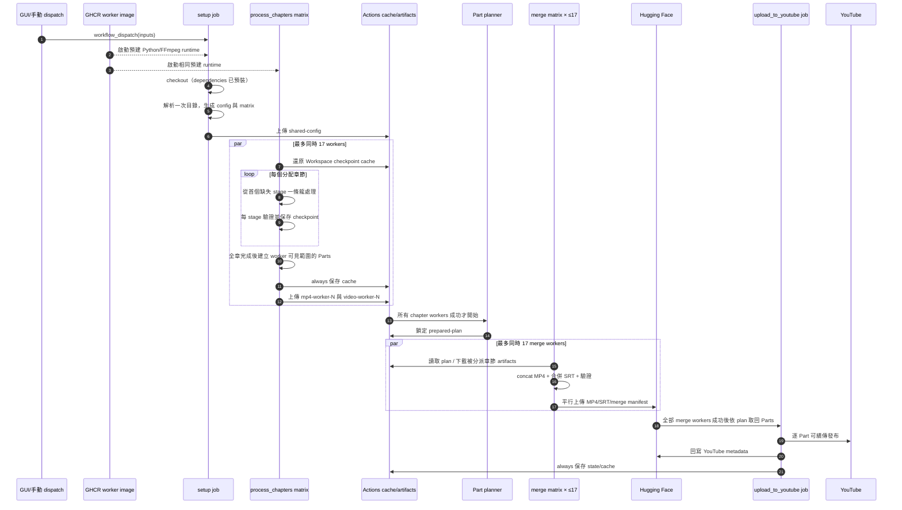

# 03 現行執行流程

本章描述單部小說的媒體產製主路徑；2026-08-19 起，批量佇列、調度器與 HF 備份以第 08 章為準。GUI 不再以單一 `current_run_id` 作為正式任務來源，而以 GitHub queue 的 task ID/Run ID 對應為準。

## 0. 封面資訊與手動封面

1. GUI 解析目錄後取得書籍 profile 指紋，才啟用「手動上傳封面」。視窗初次開啟只讀取通過新版 schema 的快取，不呼叫 Gemini。
2. 操作者按「開始產生封面資訊」後，程式取得目錄書名、作者、類型與簡介，再以書名＋作者聯網搜尋並保存來源文字與網址。
3. 第一次 Gemini 產生身分、至少五條來源化故事事實、七類分析與 HF Prompt，通過書名／作者、來源編號、完整度及 Prompt 字數驗證後才進入下一步。
4. 第二次 Gemini 以相同來源獨立考據並重寫草稿，移除無證據細節及被誤當實物的宣傳比喻；再次通過品質閘門後才顯示與快取。
5. 任一步驟失敗均清空當次內容並報錯，不得保留部分輸出、改用通用 Prompt 或繼續 HF 生圖。
6. 手動圖片標準化及 SHA-256 驗證後，同步至 `manual-covers/<book_profile_id>/master_cover.jpg`，並將 repo、遠端路徑、尺寸、bytes、quality 與 SHA-256 寫入永久 profile。
7. 雲端 metadata 階段前依 profile 從 HF 還原手動 `master_cover.jpg`；驗證失敗就停止，成功則完全跳過 Gemini 與 HF FLUX。

## 1. GUI 啟動與選章

1. 從儲存庫根目錄執行 `python gui_app.py`。
2. GUI 載入根目錄 `.env`。操作者輸入目錄 URL，按「解析章節」。
3. 背景 thread 呼叫 `parse_catalog(url)`；成功後保存 `catalog_data`、顯示書名與總章數，預填 1～總章數。
4. 操作者可開啟篩選視窗。勾選狀態以全書 1-based UUID 保存到 `excluded_chapters`；排列狀態以 UUID 陣列 `chapter_order` 保存。自動正規化排序、多選拖曳或上下移動後，GUI 依排列中仍勾選的章節重算連續「編號章節數」。
5. 按雲端製作後，GUI 驗證 token 與數字範圍，POST `audiobook.yml/dispatches`，ref 固定為 `master`。inputs 必須包含書名、URL、起訖章、排除清單，以及 Base64 JSON 格式的 `chapter_order_b64`；佇列任務亦須持久保存同一順序。書名用於 Actions Run 可讀名稱。
6. dispatch 成功 4 秒後輪詢最近的 workflow runs，依 workflow 名稱及觸發時間選定 run，保存 `current_run_id`，每 5 秒更新狀態。
7. jobs 以每頁 100 筆讀取；執行中每至少 12 秒讀 log，解析 `[PROGRESS_MARKER]`、`[API_UPLOAD_MARKER]`、`[API_UPLOAD_STATUS]`。取消按鈕對 `current_run_id` 發送 cancel。

注意：GitHub dispatch API 不回傳 run ID，因此輪詢配對存在同時啟動同名 workflow 時誤配的風險；這是現行限制。

## 2. GitHub Actions 生產主流程

### 2.1 setup job

- 僅在 `workflow_dispatch` 執行。
- 使用 `ghcr.io/hub-google/audiobook-worker` 的固定 image digest；Python 與 requirements 已預裝，不在 job 內 pip install。目錄解析重試 3 次。
- `generate_matrix` 最多建立 20 workers，輸出每 worker 的顯示起訖章；實際分配仍由 shared config 的陣列切片決定。
- 上傳 `shared-config` artifact，matrix JSON 經 job output 傳給下一 job。

### 2.2 process_chapters job

- `strategy.fail-fast=false`、`max-parallel=17`；即使 matrix 建立 20 個 worker，也只能同時執行 17 個，其餘等待 runner 名額。
- 使用與 setup/merge/publisher 相同的 GHCR image；FFmpeg、CJK fonts 及 Python dependencies 已在 image build 階段安裝與驗證。
- **跨 Run 歷史產物繼承（Cross-Run Historical Artifact Inheritance）**：
  - Worker 啟動後，首先透過 `inherit_historical_artifacts` 依 `queue_task_id` 或書名，由新至舊**無限倒序回溯**該小說的所有歷史 Run。
  - 自動下載上一輪（或歷史上任一有效輪次）的 `mp4-worker-N` 與 `video-worker-N` Artifacts 解壓至工作目錄；若被使用者手動刪除（404）則自動跳過並繼續回溯更早的 Run，直至所有章節齊全或查無更多歷史為止。
- **快取還原（Cache Fallback）**：
  - 接著以「書名、章號範圍、worker ID」為 prefix 還原 `Workspace/` cache，補齊 Artifacts 遺漏之章節。
- 執行 `python src/worker_pipeline.py --stage pipeline --worker-id N --batch-size 1`：
  - 凡四件套（MP4/SRT/WAV/JPG）已完整驗證之章節**一律 0 秒直接跳過**，語音引擎僅針對未補齊之少量章節進行爬蟲與 TTS 合成。
- 不論成功失敗，`always()` 保存 Workspace cache。
- 成功路徑上傳兩份 artifact：`mp4-worker-N` 僅含 Video/Subtitles/Upload_Subtitles，供發布；`video-worker-N` 含完整 Workspace，供檢查。

### 2.3 單一 worker 內部

worker 用 `start = worker_id × chapters_per_worker` 對 `chapters` 與 `selected_indices` 做相同切片。每章按選取清單順序呼叫 `run_resumable_chapter`：

setup 建立選取清單時必須先按 `chapter_order` 取出 UUID 對應的 URL，再將「編號章節數」寫成連續 `selected_indices`。因此 worker 清單切片天然沿用 GUI 的實際製作順序，不得先按來源索引排序。

1. checkpoint 載入後重新驗證磁碟產物；JSON 說 completed 但產物失效時不得跳過。
2. crawler 產生 RawText。
3. cleaner 取得任務快照中的每書刪除文字清單，先統一 CRLF/CR 為 LF，再以完整字面 `str.replace()` 刪除所有完全相同片段後產生 CleanText；不得把使用者輸入交給正則表達式。GUI 文字抽查必須呼叫同一 `clean_text_content()`，不得維護另一套預覽規則。
4. TTS operation 同時產生 WAV 與 SRT；兩個 stage 一起標 running/completed/failed。
5. image 產生章節卡。
6. video 產生單章 MP4，`build_parts=False`。
7. 成功輸出進度 marker；失敗記錄後繼續其他章，避免單章遮蔽整批進度。
8. 全部跑完後，只要 `incomplete_chapters()` 非空，worker 以非零狀態結束。
9. 僅全部完整時才呼叫全量 video stage 建 Parts，並記錄 worker-level `part_build`。

## 3. YouTube 發布流程

`upload_to_youtube` 依賴整個 matrix 成功。它使用同一份 GHCR 預建 runtime，不再現場安裝依賴及 FFmpeg；還原 `upload_resume_state/`、書籍 Cover 與 Upload_Subtitles cache 後執行 uploader。

1. 讀取同 run 的 `state.json`；若是 paused 且未到 `retry_at`，回傳 75，不呼叫 YouTube。
2. 從來源 run 下載 `shared-config`，避免誤用 repository 內另一書的設定。
3. 建立/沿用 master cover 與播放清單；尚未取得全書實測總時長時使用 `[處理中]《小說名稱》全集`，不得先填推估時數。
4. 優先完成既有 pending 縮圖、字幕、playlist、publish，不先建立新影片。
5. 下載所有 `mp4-worker-*`，掃描章號、時長及 SRT；inventory 必須覆蓋設定範圍且無重複/缺章。
6. 依 10～11 小時分組，建立 deterministic Part plan，寫入 checkpoint 指紋；已鎖 plan 不得靜默改變。
7. 合併 Part MP4、合併偏移後 SRT、產生 Part metadata/cover。
8. 逐 Part 先以 private 建立影片並立即保存 Video ID；再完成縮圖、CC、playlist、目標隱私與遠端驗證。
9. 全部 Part 發布並通過最終回讀後，加總鎖定 Part plan 的實測秒數，以 `floor(總秒數 / 3600)` 取得不補零的整數小時，將清單改名為 `[已完結]《小說名稱》XX小時 全集`；改名失敗不得宣告完成。
10. 每個耐久步驟後保存 state；全部 Part 完成且正式標題更新成功才印 `[API_UPLOAD_STATUS] COMPLETE`。
11. job 的 `always()` summary 顯示進度與 pending 數，並保存新 cache key。

`quotaExceeded`、`uploadLimitExceeded`、縮圖 429、字幕/playlist 暫時失敗會留下可續傳狀態。`queue-dispatcher.yml` 每 15 分鐘及 production `workflow_run` 完成時檢查確定的 task ID/Run ID；未到 `retry_at` 不呼叫 YouTube，到期才 rerun failed jobs。不得再以「最近一次手動 run」猜測重試目標。

## 4. 本地單機流程

1. 手動準備根目錄 `config.yaml`。
2. 安裝 Python dependencies、FFmpeg/ffprobe 及中文字型。
3. 執行 `python src/main_pipeline.py`。
4. 依序呼叫 crawler、cleaner、TTS、image、video；video 全量模式建立 full SRT、metadata 與 Parts。

現行本地 orchestrator 對每步各自 `try/except`，失敗仍進下一步，最後仍印 Completed；它未使用 `PipelineCheckpoint`，也沒有總體非零失敗碼。開發/驗收應另外檢查 log 與產物，或直接用 `worker_pipeline.py --stage pipeline --worker-id 0 --config <path>` 取得嚴格驗收語意。

## 5. 目前不可用或不一致的 GUI 分支

- 「YouTube 上傳（自動續傳）」會 dispatch `youtube_upload.yml`，但目前 `.github/workflows/` 只有 `audiobook.yml`；此按鈕現行會收到 GitHub API 404。主 workflow 已自動包含 YouTube 發布。
- 「一鍵下載成品」查詢 tag `run-<run_id>` 的 GitHub Release，但現行 workflow 只上傳 Actions artifacts，沒有建立 Release 或加密分卷 ZIP；因此成功 run 不會自然滿足下載器契約。
- `zip_password` 仍由 GUI/workflow input 接收，但現行 workflow 沒有使用它。
- 文件與新開發不得把上述三項描述為可用功能；修正方案見第 07 章。

## 缺章容錯與發布流程

1. Crawler 對空文章頁保存狀態碼、最終 URL、標題、回應指紋與時間證據。
2. 三次相同且非防爬的 HTTP 200 空頁確認為 `source_missing`；其他錯誤保留為 incomplete。
3. Worker 對 `source_missing` 跳過所有下游 stage，以綠色成功及 warning 結束；有效章節繼續生成 MP4。
4. Worker 無論最終成功或失敗都上傳已完成 MP4、字幕與 `SourceStatus` artifact，讓 uploader 能驗證來源缺漏。
5. Uploader 先盤點所有 artifact；只有 durable `source_missing` 證據可以填補 inventory 缺口。
6. Part 計畫依有效章節排序及實際時長建立，允許跨越已確認缺章，並在影片說明列出該 Part 的來源缺章。
7. 未確認缺口、媒體錯誤或 YouTube 未完成步驟使 run 保持失敗；30 分鐘排程無次數上限地重跑 failed jobs。
8. 全部 Part 通過 YouTube 最終回讀後 run 轉為成功，後續排程只回報成功，不再續作。
## 8. 章節完成後的 Part 準備與發布流程

正式雲端流程必須分成彼此獨立的兩個 job，不得再於同一個 Part
迴圈內交錯執行合併與外部發布：

1. 最多 17 個章節 worker 完成所有單章 MP4、SRT 及來源缺章證據。
2. `prepare_parts` 盤點全書章節與時長，一次鎖定完整 Part plan；任何
   Part 媒體產生前必須先完成連續性與缺章驗證。
3. planner 將 Parts 分派給最多 17 個 merge workers；Part 數少於 17 時只
   建立所需數量，Part 數超過 17 時每個 worker 可負責多個 Part。
4. 每個 merge worker 只下載被分派 Parts 所需的 chapter artifacts，使用
   FFmpeg concat stream copy 產生 MP4/SRT，驗證後立即平行上傳 HF，並以
   `merge_manifest.json(status=merge_complete)` 作為完成提交。HF 上傳不依序。
5. GitHub 只保存小型 `prepared-plan`；大型 Part MP4/SRT 不得再上傳 GitHub
   artifact。HF 媒體與 merge manifest 是 publisher 的正式交接 artifact。
6. 全部 merge matrix jobs 成功後，唯一 publisher 依 plan 從 HF 取回並驗證
   Parts，不得下載單章 artifacts、重新分組或重新合併。
7. publisher 嚴格依 `part_num` 由小至大執行：YouTube 私有上傳 → thumbnail
   → CC → playlist position → 目標 privacy → 最終驗證 → HF YouTube metadata finalize。
8. Part N 發布失敗或 quota 暫停時，Part N+1 不得發布；斷點必須保存已取得
   的 Video ID 與待辦步驟，重試不得重傳已成功的影片。

效能要求：Part 合併與 HF 上傳必須使用最多 17 台 matrix workers 平行完成；
只有 YouTube 發布因 playlist 順序及斷點一致性限制採單一 runner 串行執行。
